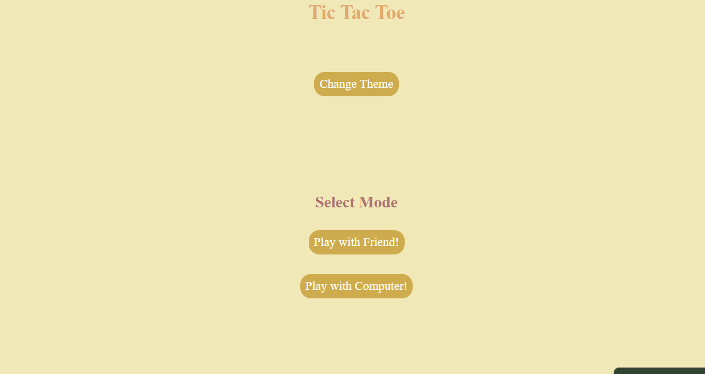
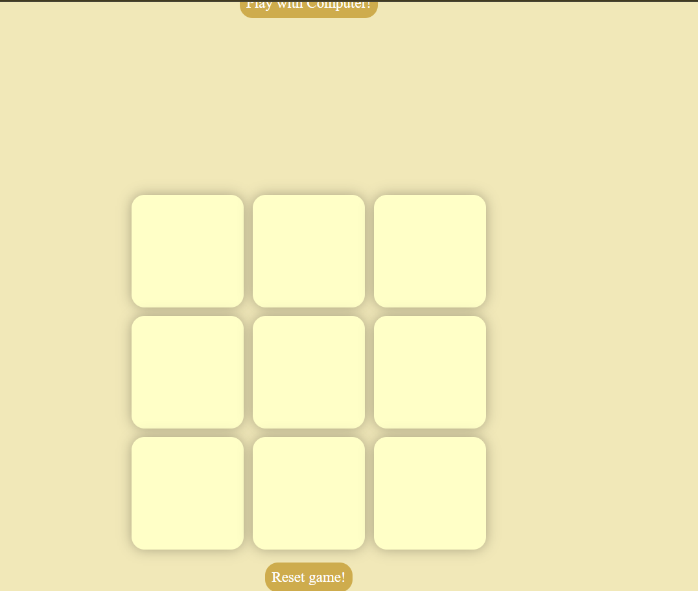

Tic-Tac-Toe Game

A classic Tic-Tac-Toe game built using **HTML, CSS, and JavaScript**. The game features an interactive user interface, winner detection, draw detection, and a responsive design for both desktop and mobile devices.

Live Demo

https://kangnagupta1225.github.io/Tic-Tac-Toe-game/

Screenshot




Features

-  Two-player gameplay
-  Automatic winner detection
-  Draw detection
-  Restart game functionality
-  Responsive design
-  Clean and modern user interface

Technologies Used

- HTML5
- CSS3
- JavaScript (ES6)

Project Structure

```
Tic-Tac-Toe-game/
│
├── index.html
├── style.css
├── index.js
├── images/
│   └── screenshot.png
│   └── screenshot1.png
└── README.md
```

How to Run

1. Clone the repository
2. Open `index.html` in your browser

Future Improvements

- Add AI opponent
- Sound effects
- Scoreboard
- Winning animations

Author

Kangna Gupta

⭐ If you like this project, consider giving it a star!